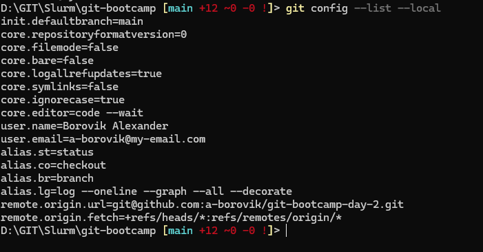
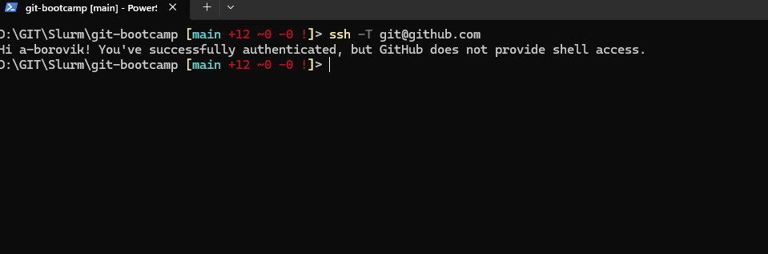
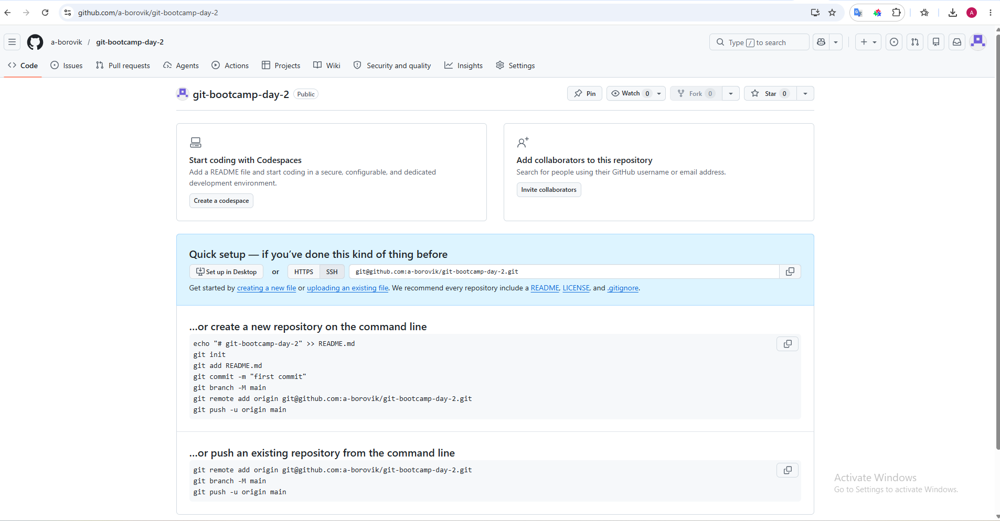
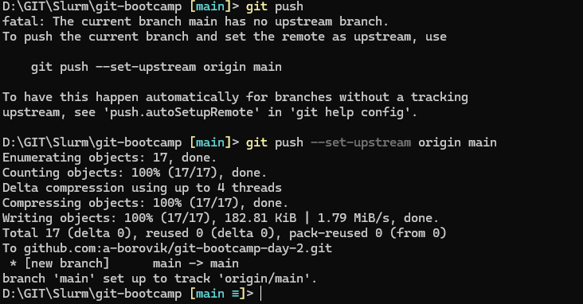
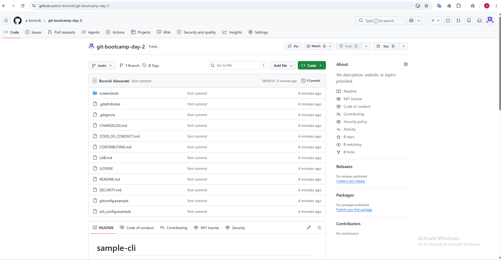

# LAB — день 2

Отчёт о выполнении домашнего задания дня 2 в рамках курса ["Интенсив по погружению в GIT"](https://slurm.io/git-intensive): настройка `gitconfig` и SSH, создание публичного репозитория, наполнение его служебными и стандартными файлами.

## Содержание

- [LAB — день 2](#lab--день-2)
  - [Содержание](#содержание)
  - [Настройка gitconfig](#настройка-gitconfig)
  - [SSH-ключ и подключение к GitHub](#ssh-ключ-и-подключение-к-github)
  - [Создание репозитория](#создание-репозитория)
  - [Служебные файлы](#служебные-файлы)
    - [`.gitignore`](#gitignore)
    - [`.gitattributes`](#gitattributes)
  - [Стандартные файлы и выбор лицензии](#стандартные-файлы-и-выбор-лицензии)
    - [Почему именно эта лицензия](#почему-именно-эта-лицензия)
  - [Markdown](#markdown)
  - [Финальный пуш](#финальный-пуш)

## Настройка gitconfig

Заданы следующие параметры:
- `defaultBranch = main` - задаем название ветки по умолчанию;
- `name` = Borovik Alexander - Имя и фамилия пользоватлея;
- `email` = your@email.com - его email;

Задаем свои алиасы для часто используемых команд:
-  `st = status`
-  `co = checkout`
-  `br = branch`
-  `lg = log --oneline --graph --all --decorate`

Скриншот вывода `git config --local --list`(взят конфигlocal, чтобы не светить свои рабоиче данные):



Полный фрагмент моего конфига — в файле [`gitconfig.example`](gitconfig.example).

## SSH-ключ и подключение к GitHub

Использовал алгоритм (`ed25519`), в `~/.ssh/config` положил хост github.com под каким юзером подключаться и путь к закрытому ключу. 

Скриншот ответа GitHub на `ssh -T git@github.com`:



Фрагмент моего `~/.ssh/config` — в файле [`ssh_config.example`](ssh_config.example).

## Создание репозитория

При создании репозитория выбрал видимость Public, README/license собирал всё локально и пушил потом.

Скриншот свежесозданного репозитория:



## Служебные файлы

### `.gitignore`

Стек: `Java`. Выбрал, потому что использую на работе.

За основу взял шаблон с `https://www.toptal.com/developers/gitignore/api/java` и добавил правила ОС Windows, Linux и VSCode.

### `.gitattributes`

Минимум — `* text=auto` для нормализации переносов строк между macOS/Linux и Windows. Дополнительные правила:

```text
# Явно указать файлы которые всегда должны быть с LF (Unix-стиль)
*.sh text eol=lf
*.yml text eol=lf
*.yaml text eol=lf
# Бинарные файлы — не трогать вообще
*.png binary
*.jpg binary
*.gif binary
*.ico binary
*.zip binary
*.pdf binary
*.exe binary
```

## Стандартные файлы и выбор лицензии

В корне лежат:

- [x] [`README.md`](README.md) — визитка проекта.
- [x] [`CHANGELOG.md`](CHANGELOG.md) — формат Keep a Changelog.
- [x] [`LICENSE`](LICENSE) — выбранная лицензия.
- [x] [`CONTRIBUTING.md`](CONTRIBUTING.md) — как контрибьютить.
- [x] [`CODE_OF_CONDUCT.md`](CODE_OF_CONDUCT.md) — Contributor Covenant.
- [x] [`SECURITY.md`](SECURITY.md) — политика раскрытия уязвимостей.

### Почему именно эта лицензия

На что смотрели при выборе:
- что хочется разрешить использовать, модифицировать;
- совместимость с другими лицензиями, если планируете заимствовать чужой код.


## Markdown

В этом отчёте и в `README.md` использованы:

- заголовки `H1`/`H2`/`H3`;
- оглавление в начале со ссылками на якоря;
- блоки кода с подсветкой (`bash`, `text`);
- сворачиваемый блок (см. ниже);
- ссылки на внешние URL.

<details>
<summary>Сворачиваемый блок:</summary>

Содержимое.

</details>

## Финальный пуш

[FIXME: одним предложением — на какую ветку пушили (`main`), какие были предупреждения GitHub, как подтверждали что репо публичный.]
Ветку пушил на `main`

Терминал с пушем:



Главная страница репозитория после пуша:



